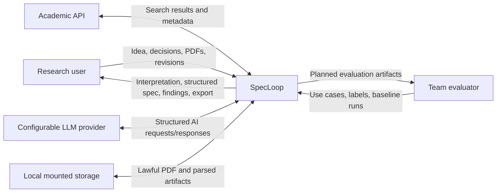
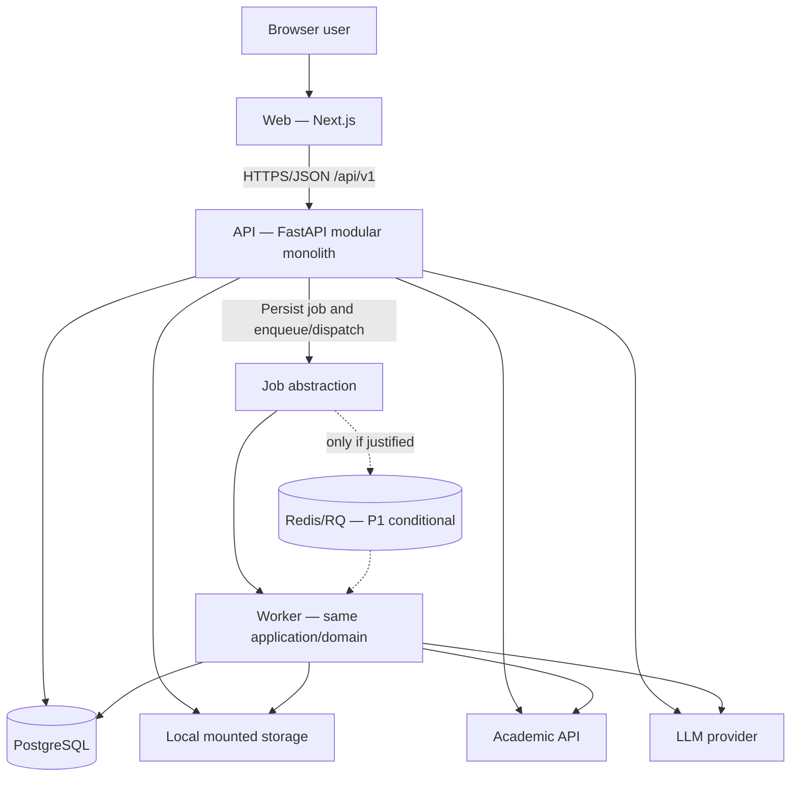
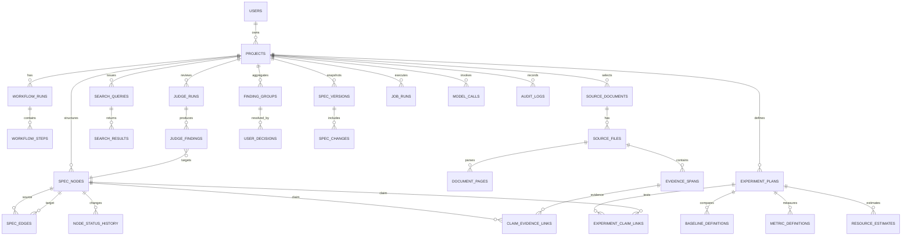

# SpecLoop — Architecture and Technical Design

**Trạng thái:** `PLANNED` — chưa có source code hoặc deployment được xác nhận  
**Architecture style:** monorepo, modular monolith, background jobs  
**P0 stack:** Next.js, FastAPI, PostgreSQL, PyMuPDF, local mounted storage, Docker Compose

## 1. Architecture goals and constraints

### Goals

- Hỗ trợ vertical slice idea → evidence → spec → Judge → revision trong bốn tuần.
- Giữ domain boundaries rõ để ba role có thể làm song song nhưng tích hợp liên tục.
- Bảo toàn provenance, user/system authority, version history và job status.
- Cô lập external API/LLM/PDF failures bằng timeout, bounded retry và explicit error state.
- Có đường nâng cấp từ in-process job sang Redis/RQ mà không đổi business model.
- Có reproducible local/Docker deployment và testable interfaces.

### Constraints

- Một repository `spec-research-loop`.
- Modular monolith; không microservices, không database-per-module.
- Background worker thuộc cùng application/domain, không phải business service độc lập.
- PostgreSQL là shared source of truth.
- Local mounted storage cho P0; MinIO/S3 không thuộc P0.
- PyMuPDF cho PDF P0; GROBID không thuộc P0.
- Redis/RQ chỉ dùng khi đo thực tế cho thấy in-process jobs không đủ; mặc định P1.
- Không Kafka, Kubernetes, event sourcing hoặc service mesh.

## 2. Why modular monolith instead of microservices

Modular monolith phù hợp hơn với team ba người và bốn tuần vì:

1. Một deployable backend và một shared transaction boundary giảm chi phí integration, networking, auth, observability và deployment.
2. Capability modules vẫn tạo ownership/boundary rõ mà không cần distributed contracts.
3. Workflow có quan hệ dữ liệu chặt giữa project, nodes, evidence, findings, decisions và versions; shared database hỗ trợ consistency đơn giản hơn.
4. Background processing có thể tách execution khỏi request path mà không tách business ownership.
5. Test end-to-end và local setup dễ tái lập hơn.

Trade-off là scaling/deployment theo module chưa độc lập. Chỉ xem xét microservices khi có evidence về nhu cầu scale/ownership/failure isolation vượt khả năng modular monolith; đó không phải quyết định trong P0.

## 3. Monorepo structure

```text
spec-research-loop/
├── apps/
│   ├── web/                 # Next.js UI
│   ├── api/                 # FastAPI modular monolith
│   └── worker/              # same-domain job runner
├── packages/
│   ├── schemas/             # shared contracts/generated clients if adopted
│   └── prompts/             # prompt templates and metadata
├── infrastructure/          # Docker and local deployment assets
├── tests/                   # cross-application integration/E2E fixtures
├── docs/
├── AGENTS.md
├── README.md
└── docker-compose.yml
```

Đây là planned structure. Không được coi các path chưa tồn tại là implementation status.

## 4. Technology stack and rationale

| Area | Choice | Rationale | Scope note |
| --- | --- | --- | --- |
| Frontend | Next.js + TypeScript | Typed UI, routing và workflow screens trong một web app | P0 |
| Styling | Tailwind CSS | Tạo UI nhất quán nhanh trong thời gian ngắn | P0 |
| Server state | TanStack Query | Cache/invalidation và job polling rõ ràng | P0 |
| Backend | FastAPI + Pydantic | Async-capable API, explicit schemas, OpenAPI và validation | P0 |
| Persistence | SQLAlchemy + Alembic | Transactional repository/migration path cho PostgreSQL | P0 |
| Database | PostgreSQL | Relational integrity cho graph-like domain, provenance và versions | P0 |
| PDF | PyMuPDF | Page-aware text extraction phù hợp evidence spans | P0 |
| File storage | Local mounted volume | Đơn giản, tái lập trong Docker Compose | P0 |
| Background work | Job abstraction + persisted status | Tách lifecycle job khỏi HTTP request | P0 |
| Queue | Redis + RQ | Chỉ thêm nếu long jobs cần external queue/recovery | P1 |
| AI | Một configurable LLM provider | Giảm integration scope, giữ provider boundary | P0 |
| Delivery | Docker Compose | Local reproducibility cho web/API/database/storage và optional worker | P0 |

Exact versions và provider/API selection vẫn là Open Questions, không được suy ra là đã cài đặt.

## 5. System Context Diagram



External documents và API/LLM responses đều là untrusted input, không phải instruction.

## 6. Container Diagram



P0 có thể thực thi job nhỏ trong API process qua cùng abstraction. Worker dùng chung domain code và database; đường nối Redis/RQ là conditional P1.

## 7. Backend module boundaries

| Module | Responsibility | Owns data/operations | Depends on |
| --- | --- | --- | --- |
| `projects` | Project lifecycle, idea, domain, constraints | projects | operations |
| `idea_understanding` | Interpretation, confirmation gate, decisions | workflow steps, user decisions | projects, AI gateway |
| `spec_structure` | Typed nodes, edges, statuses, integrity of relations | spec nodes/edges/history | projects |
| `literature` | Query, academic search, normalize, deduplicate, select | sources, queries, results | projects, external API gateway |
| `evidence` | Files, pages, spans, provenance, claim links, verifier | files/pages/spans/links | literature, spec_structure, AI gateway |
| `research_design` | Gap, contribution, claim, experiment, feasibility | experiment plans, baselines, metrics, estimates | spec_structure, evidence |
| `spec_generation` | Assemble 14-section specification | generated drafts | prior capability modules, AI gateway |
| `judging` | Three independent Judges, findings, aggregation | judge runs/findings/groups | spec_generation, evidence, research_design |
| `revision` | User actions, targeted changes/reruns | decisions/change requests | judging, spec_structure |
| `versions` | Snapshots and basic diff | spec versions/changes | revision, spec_generation |
| `exports` | Finalization gate and Markdown export | export records/artifacts | versions, evidence, judging |
| `operations` | Job state, prompt/model calls, audit, limits | job runs/model calls/audit logs | all modules through narrow interfaces |

Modules communicate bằng application services/contracts trong cùng backend. Không gọi nhau qua network và không sở hữu database riêng.

## 8. Main workflow

1. `projects` creates project and records raw idea/constraints.
2. `idea_understanding` invokes structured interpretation and waits for `USER_CONFIRMED`.
3. `spec_structure` creates typed nodes/relations and applies basic status rules.
4. `literature` searches one API or accepts manual source; user selects corpus.
5. `evidence` validates PDF/manual text, parses pages, stores span/provenance and links claims.
6. `research_design` produces corpus-bounded gap, claims, experiment plan and estimate.
7. `spec_generation` builds the 14-section draft from allowed confirmed inputs.
8. `judging` runs three independent jobs and aggregates findings deterministically.
9. `revision` records user action; relevant nodes/spec are changed and checks rerun where feasible.
10. `versions` snapshots the result and calculates basic diff; `exports` enforces finalization and produces Markdown.

Each long-running step writes `job_runs` status; HTTP requests do not wait indefinitely.

## 9. Domain model

### Core aggregates

- **ResearchProject:** root for idea, constraints, workflow status and selected corpus.
- **SpecGraph:** nodes, edges and node status history under a project.
- **LiteratureCorpus:** normalized source documents, files/pages, queries and selections.
- **EvidenceSet:** evidence spans and claim-evidence links with provenance.
- **ResearchDesign:** claims, experiments, baselines, metrics and estimates.
- **ReviewCycle:** Judge runs/findings/groups and user decisions.
- **SpecVersion:** immutable snapshot, changes and export state.
- **OperationRecord:** job run, model call and audit log.

### Key invariants

- Interpretation confirmation gates decomposition.
- Relations reference existing nodes in the same project.
- Evidence links reference existing source/span and target node.
- Factual claim must have allowed disposition before finalization.
- Judges cannot consume each other's findings before aggregation.
- Revision never overwrites the prior version.
- Worker and API share domain rules.

## 10. ERD



## 11. Data model summary

| Area | Planned tables | Critical fields/invariants |
| --- | --- | --- |
| Project/workflow | `users`, `projects`, `workflow_runs`, `workflow_steps`, `workflow_events` | project scope, stage, actor, timestamps |
| Spec structure | `spec_nodes`, `spec_edges`, `node_status_history` | type/status enums, same-project relations, authority |
| Literature | `source_documents`, `source_files`, `document_pages`, `search_queries`, `search_results` | normalized identifiers, provenance tier, page order |
| Evidence | `evidence_spans`, `claim_evidence_links` | source file/page, offsets, exact text, entry type, target validity |
| Research design | `experiment_plans`, `experiment_claim_links`, `baseline_definitions`, `metric_definitions`, `resource_estimates` | assumptions vs measurements, claim coverage |
| Review | `judge_runs`, `judge_findings`, `finding_groups`, `user_decisions` | independence, target/type/severity, decision actor |
| Version/operations | `spec_versions`, `spec_changes`, `prompt_templates`, `prompt_versions`, `model_calls`, `job_runs`, `audit_logs` | immutable snapshot, prompt/model provenance, state transitions |

Đây là conceptual model; types, indexes, constraints và migrations chỉ được chốt trong implementation/ADR sau review.

## 12. API conventions

- Base path: `/api/v1`.
- JSON request/response với Pydantic schemas; timestamps ISO 8601 UTC.
- Resource IDs là opaque UUIDs; client không suy diễn cấu trúc.
- Error envelope planned: `{ code, message, details, correlation_id }`; không trả private stack trace.
- Long operation trả job reference và status endpoint thay vì giữ request mở.
- Idempotency được xem xét cho create-job/regenerate/finalize commands.
- Pagination bắt buộc cho source/search/job/history collections khi implementation chốt contract.
- Authorization scope theo project, dù P0 có thể dùng demo user.

### Main planned APIs

| Area | Planned endpoint | Purpose | Execution |
| --- | --- | --- | --- |
| Projects | `POST /api/v1/projects`; `GET/PATCH /api/v1/projects/{project_id}` | Project CRUD | Sync |
| Interpretation | `POST /projects/{id}/interpretations` | Generate interpretation | Job |
| Decisions | `POST /projects/{id}/decisions` | Confirm/edit/Other | Sync |
| Spec graph | `GET/POST/PATCH /projects/{id}/nodes`; `POST/DELETE /edges` | Nodes/relations | Sync |
| Literature | `POST /projects/{id}/literature/search`; `POST /sources/import` | Search/manual import | Job/sync |
| Files | `POST /projects/{id}/source-files`; `POST /source-files/{id}/parse` | Upload/parse PDF | Sync + job |
| Evidence | `POST /projects/{id}/evidence-spans`; `POST /claim-evidence-links` | Store/link evidence | Sync |
| Integrity | `POST /projects/{id}/integrity-checks` | Deterministic/atomic checks | Job |
| Research design | `POST /projects/{id}/research-design`; `POST /experiment-plans` | Gap/claim/experiment/estimate | Job |
| Specification | `POST /projects/{id}/specifications/generate` | Generate 14 sections | Job |
| Judges | `POST /projects/{id}/judge-runs`; `GET /judge-runs/{id}` | Run/read three Judges | Job |
| Revision | `POST /projects/{id}/revisions` | Apply user-directed revision | Job |
| Versions | `GET /projects/{id}/versions`; `GET /versions/{a}/diff/{b}` | Snapshot/diff | Sync |
| Export | `POST /versions/{id}/finalize`; `GET /versions/{id}/export.md` | Finalize/export | Sync/job as needed |
| Jobs | `GET /jobs/{id}` | Job status/error/progress | Sync |

Endpoint names are design proposals with status `PLANNED`, not existing commands or routes.

## 13. Background-job strategy

### P0

- Application-level `JobRunner` abstraction with persisted `job_runs`.
- State machine and terminal error status defined once for API/in-process/worker execution.
- Small demo jobs may execute in API process after response dispatch.
- Long tasks are resumable/retriable only where explicitly safe; user sees status.
- Timeout/retry/budget are passed as policy, not hard-coded across modules.

### P1 activation criteria for Redis/RQ

Consider Redis/RQ only if observed jobs exceed acceptable request-process lifetime, need crash recovery/concurrency control, or materially block demo responsiveness. Numeric thresholds remain a team Open Question. Adding Redis/RQ must not change domain models or create a business microservice.

## 14. File storage and PDF processing

### Storage

- P0 root is a mounted private volume, never the public web root.
- Store generated UUID filename and keep original filename only as sanitized metadata.
- Database stores logical metadata/path; file system stores bytes.
- Project ownership and deletion policy apply through application service.

### PDF pipeline

```text
Upload
→ extension/MIME/size/page-limit checks
→ generated filename
→ encrypted/malformed detection
→ PyMuPDF page extraction
→ store page text
→ user selects exact span or manual evidence
→ validate offsets/exact text
→ link provenance to claim
```

Exact size/page limits are Open Questions. GROBID and MinIO are P2.

## 15. Error handling

- Domain errors: invalid transition, relation, missing source/evidence, finalization block.
- Validation errors: stable machine code + field details.
- External dependency errors: timeout, rate limit, transient/permanent classification.
- AI schema errors: one bounded repair attempt within approved 1–2 range, then error status/fallback.
- PDF errors: reject unsafe/unreadable file and offer manual evidence fallback.
- Job failure preserves diagnostic code/correlation ID without exposing secrets/private reasoning.
- No infinite retry; side-effecting operations require idempotency/duplicate guards.

## 16. Logging and observability

P0 logs:

- correlation ID, project/job/request identifiers;
- event/status, duration measured by application;
- provider/model/prompt version, token usage when returned, retry/status;
- estimated cost clearly labeled;
- security-relevant upload/rejection and budget events;
- no PDF content, secret, sensitive full prompt, or private chain-of-thought by default.

Metrics/dashboard and distributed tracing beyond demo needs are not claimed. Advanced observability is P2; cost dashboard is P1.

## 17. Security boundaries

1. Browser input validates at UI and API; API remains authority.
2. PDFs and document text are untrusted data; never tool/system instructions.
3. System prompt, user data and document context are separated and delimited.
4. LLM has no direct database/file/tool authority; application validates structured output and referenced IDs.
5. Upload allowlist, MIME/size/page limits, UUID filename and private storage are mandatory.
6. External API/LLM secrets are environment-managed and never committed/logged.
7. Project access checks apply even with a simplified demo user model.
8. Token/paper/Judge/cost limits have warning and hard stop.
9. SQL access uses ORM/parameters; output escapes untrusted text in UI/export context.
10. No private chain-of-thought is requested or stored.

## 18. Docker Compose deployment

Planned P0 services:

- `web`: Next.js.
- `api`: FastAPI modular monolith.
- `db`: PostgreSQL with persistent volume.
- `worker`: same code/domain image, enabled for jobs selected by architecture decision.
- shared private file volume for API/worker.

`redis` is an optional P1 profile only after activation criteria. Compose health checks, migrations, configuration validation and documented startup commands must be verified after implementation; none are claimed now.

## 19. Architecture trade-offs

| Decision | Benefit | Cost/limitation |
| --- | --- | --- |
| Modular monolith | Fast integration, one transaction/data model | No independent module deployment |
| Shared PostgreSQL | Referential integrity and simple transactions | Requires disciplined module ownership |
| Local storage | Low setup complexity | Single-node/local durability and scale only |
| In-process P0 jobs | Avoid queue integration | Weaker crash recovery/concurrency |
| One academic API | Lower integration/rate-limit risk | Narrower discovery coverage |
| One LLM provider | Lower prompt/provider complexity | Provider-specific dependency and less ensemble diversity |
| Deterministic aggregation | Testable and explainable | Less semantic clustering flexibility |
| Markdown-only export | Reliable scope | No formatted PDF/DOCX in MVP |

## 20. Conditions for revisiting decisions

Record an ADR before changing a material decision. Reconsider only with evidence such as:

- Job duration/failure/recovery needs justify Redis/RQ.
- Storage volume/availability requirements exceed local mounted storage.
- Provider limitations block required structured output or budget controls.
- Module scale, ownership or failure isolation demonstrates a need beyond modular monolith.
- PDF extraction quality materially blocks evidence integrity and justified alternative fits scope.

Microservices, Kubernetes, MinIO, GROBID, event sourcing and service mesh remain outside P0 even if they appear technically attractive. A future decision cannot retroactively claim implementation or test success.
