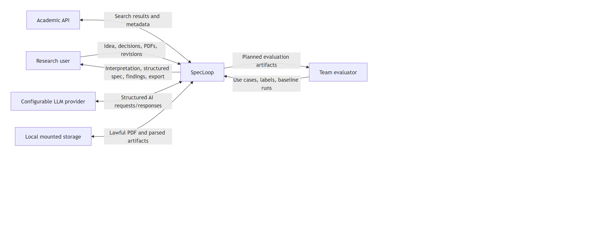
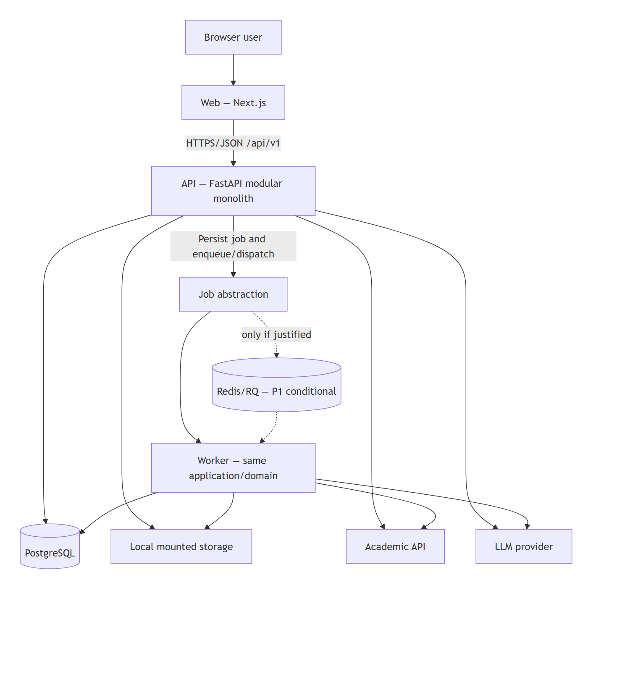
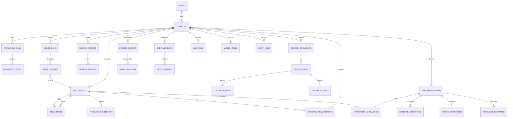

# SpecLoop — Architecture and Technical Design

**Trạng thái:** `SCAFFOLDED` — local install/typecheck/build/smoke đã được xác nhận; product workflow và deployment vẫn `PLANNED`
**Architecture style:** monorepo, modular monolith, background jobs  
**P0 stack:** Next.js, Node.js + tRPC, PostgreSQL, `pdfjs-dist`/`pdf-parse`, local mounted storage, Docker Compose

> **Override notice:** The backend stack recorded in the approved proposal
> (FastAPI + Python) is replaced by **Node.js + TypeScript + tRPC** under
> [ADR-001](adrs/ADR-001-trpc-backend.md). Source documents under `docs/source/`
> are not edited; this file and other derived documents reflect the accepted
> ADR.

## 1. Architecture goals and constraints

### Goals

- Hỗ trợ vertical slice idea → evidence → spec → Judge → revision trong bốn tuần.
- Giữ domain boundaries rõ để ba role có thể làm song song nhưng tích hợp liên tục.
- Bảo toàn provenance, user/system authority, version history và job status.
- Cô lập external API/LLM/PDF failures bằng timeout, bounded retry và explicit error state.
- Có đường nâng cấp từ in-process job sang Redis/BullMQ mà không đổi business model.
- Có reproducible local/Docker deployment và testable interfaces.

### Constraints

- Một repository `spec-research-loop`.
- Modular monolith; không microservices, không database-per-module.
- Background worker thuộc cùng application/domain, không phải business service độc lập.
- PostgreSQL là shared source of truth.
- Local mounted storage cho P0; MinIO/S3 không thuộc P0.
- `pdfjs-dist`/`pdf-parse` cho PDF P0; GROBID không thuộc P0.
- Redis/BullMQ chỉ dùng khi đo thực tế cho thấy in-process jobs không đủ; mặc định P1.
- Không Kafka, Kubernetes, event sourcing hoặc service mesh.

## 2. Why modular monolith instead of microservices

Modular monolith phù hợp hơn với team ba người và bốn tuần vì:

1. Một deployable backend và một shared transaction boundary giảm chi phí integration, networking, auth, observability và deployment.
2. Capability modules vẫn tạo ownership/boundary rõ mà không cần distributed contracts.
3. Workflow có quan hệ dữ liệu chặt giữa project, nodes, evidence, findings, decisions và versions; shared database hỗ trợ consistency đơn giản hơn.
4. Background processing có thể tách execution khỏi request path mà không tách business ownership.
5. Test end-to-end và local setup dễ tái lập hơn.

Trade-off là scaling/deployment theo module chưa độc lập. Chỉ xem xét microservices khi có evidence về nhu cầu scale/ownership/failure isolation vượt khả năng modular monolith; đó không phải quyết định trong P0.

## 3. Monorepo structure

```text
spec-research-loop/
├── apps/
│   ├── web/                 # Next.js UI (App Router, TypeScript)
│   ├── api/                 # Node.js + tRPC + Fastify modular monolith
│   └── worker/              # same-domain job runner (Node.js, shared schemas)
├── packages/
│   ├── schemas/             # shared Zod schemas + inferred TypeScript types
│   └── prompts/             # prompt templates and metadata
├── infrastructure/          # Docker and local deployment assets
├── tests/                   # cross-application integration/E2E fixtures
├── docs/
│   ├── architecture/adrs/   # accepted architecture decisions
│   └── source/              # immutable assignment and approved proposal
├── AGENTS.md
├── README.md
└── docker-compose.yml
```

Đây là planned structure. Không được coi các path chưa tồn tại là implementation status.

## 4. Technology stack and rationale

| Area             | Choice                             | Rationale                                                                      | Scope note       |
| ---------------- | ---------------------------------- | ------------------------------------------------------------------------------ | ---------------- |
| Frontend         | Next.js + TypeScript               | Typed UI, routing và workflow screens trong một web app                        | P0               |
| Styling          | Tailwind CSS                       | Tạo UI nhất quán nhanh trong thời gian ngắn                                    | P0               |
| Server state     | TanStack Query                     | Cache/invalidation và job polling rõ ràng                                      | P0               |
| Backend          | Node.js + tRPC + Fastify           | End-to-end typed RPC với Zod validation; một TypeScript toolchain với frontend | P0 (per ADR-001) |
| Shared contracts | Zod schemas in `packages/schemas`  | Single source of truth cho runtime validation và TypeScript types              | P0               |
| Persistence      | `pg` + node-pg-migrate             | Transactional repository/migration path cho PostgreSQL                         | P0               |
| Database         | PostgreSQL                         | Relational integrity cho graph-like domain, provenance và versions             | P0               |
| PDF              | `pdfjs-dist` / `pdf-parse`         | Page-aware text extraction phù hợp evidence spans                              | P0               |
| File storage     | Local mounted volume               | Đơn giản, tái lập trong Docker Compose                                         | P0               |
| Background work  | Job abstraction + persisted status | Tách lifecycle job khỏi HTTP request                                           | P0               |
| Queue            | Redis + BullMQ (Node)              | Chỉ thêm nếu long jobs cần external queue/recovery                             | P1               |
| AI               | Một configurable LLM provider      | Giảm integration scope, giữ provider boundary                                  | P0               |
| Delivery         | Docker Compose                     | Local reproducibility cho web/API/database/storage và optional worker          | P0               |

Exact versions và provider/API selection vẫn là Open Questions, không được suy ra là đã cài đặt.

## 5. System Context Diagram



[Mermaid source](assets/architecture/system-context.mmd)

External documents và API/LLM responses đều là untrusted input, không phải instruction.

## 6. Container Diagram



[Mermaid source](assets/architecture/container-diagram.mmd)

P0 có thể thực thi job nhỏ trong API process qua cùng abstraction. Worker dùng chung domain code và database; đường nối Redis/BullMQ là conditional P1.

## 7. Backend module boundaries

| Module               | Responsibility                                         | Owns data/operations                            | Depends on                                 |
| -------------------- | ------------------------------------------------------ | ----------------------------------------------- | ------------------------------------------ |
| `projects`           | Project lifecycle, idea, domain, constraints           | projects                                        | operations                                 |
| `idea_understanding` | Interpretation, confirmation gate, decisions           | workflow steps, user decisions                  | projects, AI gateway                       |
| `spec_structure`     | Typed nodes, edges, statuses, integrity of relations   | spec nodes/edges/history                        | projects                                   |
| `literature`         | Query, academic search, normalize, deduplicate, select | sources, queries, results                       | projects, external API gateway             |
| `evidence`           | Files, pages, spans, provenance, claim links, verifier | files/pages/spans/links                         | literature, spec_structure, AI gateway     |
| `research_design`    | Gap, contribution, claim, experiment, feasibility      | experiment plans, baselines, metrics, estimates | spec_structure, evidence                   |
| `spec_generation`    | Assemble 14-section specification                      | generated drafts                                | prior capability modules, AI gateway       |
| `judging`            | Three independent Judges, findings, aggregation        | judge runs/findings/groups                      | spec_generation, evidence, research_design |
| `revision`           | User actions, targeted changes/reruns                  | decisions/change requests                       | judging, spec_structure                    |
| `versions`           | Snapshots and basic diff                               | spec versions/changes                           | revision, spec_generation                  |
| `exports`            | Finalization gate and Markdown export                  | export records/artifacts                        | versions, evidence, judging                |
| `operations`         | Job state, prompt/model calls, audit, limits           | job runs/model calls/audit logs                 | all modules through narrow interfaces      |

Modules communicate bằng application services/contracts trong cùng backend. Không gọi nhau qua network và không sở hữu database riêng.

## 8. Main workflow

1. `projects` creates project and records raw idea/constraints.
2. `idea_understanding` invokes structured interpretation and waits for `USER_CONFIRMED`.
3. `spec_structure` creates typed nodes/relations and applies basic status rules.
4. `literature` searches one API or accepts manual source; user selects corpus.
5. `evidence` validates PDF/manual text, parses pages, stores span/provenance and links claims.
6. `research_design` produces corpus-bounded gap, claims, experiment plan and estimate.
7. `spec_generation` builds the 14-section draft from allowed confirmed inputs.
8. `judging` runs three independent jobs and aggregates findings deterministically.
9. `revision` records user action; relevant nodes/spec are changed and checks rerun where feasible.
10. `versions` snapshots the result and calculates basic diff; `exports` enforces finalization and produces Markdown.

Each long-running step writes `job_runs` status; HTTP requests do not wait indefinitely.

## 9. Domain model

### Core aggregates

- **ResearchProject:** root for idea, constraints, workflow status and selected corpus.
- **SpecGraph:** nodes, edges and node status history under a project.
- **LiteratureCorpus:** normalized source documents, files/pages, queries and selections.
- **EvidenceSet:** evidence requirements (what the metric value must satisfy for a claim to be verified) and evidence spans for source provenance.
- **ResearchDesign:** claims, experiments, baselines, metrics and estimates.
- **ReviewCycle:** Judge runs/findings/groups and user decisions.
- **SpecVersion:** immutable snapshot, changes and export state.
- **OperationRecord:** job run, model call and audit log.

### Key invariants

- Interpretation confirmation gates decomposition.
- Relations reference existing nodes in the same project.
- Evidence requirements reference an existing claim and define a verifiable metric threshold (metric, operator, threshold, success/falsification criteria).
- Factual claim must have allowed disposition before finalization.
- Judges cannot consume each other's findings before aggregation.
- Revision never overwrites the prior version.
- Worker and API share domain rules.

## 10. ERD



## 11. Data model summary

| Area               | Planned tables                                                                                                   | Critical fields/invariants                                         |
| ------------------ | ---------------------------------------------------------------------------------------------------------------- | ------------------------------------------------------------------ |
| Project/workflow   | `users`, `projects`, `workflow_runs`, `workflow_steps`, `workflow_events`                                        | project scope, stage, actor, timestamps                            |
| Spec structure     | `spec_nodes`, `spec_edges`, `node_status_history`                                                                | type/status enums, same-project relations, authority               |
| Literature         | `source_documents`, `source_files`, `document_pages`, `search_queries`, `search_results`                         | normalized identifiers, provenance tier, page order                |
| Evidence           | `evidence_spans`, `evidence_requirements`                                                                          | claim, metric, operator, threshold, success/falsification criteria, measurement method |
| Research design    | `experiment_plans`, `experiment_claim_links`, `baseline_definitions`, `metric_definitions`, `resource_estimates` | assumptions vs measurements, claim coverage                        |
| Review             | `judge_runs`, `judge_findings`, `finding_groups`, `user_decisions`                                               | independence, target/type/severity, decision actor                 |
| Version/operations | `spec_versions`, `spec_changes`, `prompt_templates`, `prompt_versions`, `model_calls`, `job_runs`, `audit_logs`  | immutable snapshot, prompt/model provenance, state transitions     |

Đây là conceptual model; types, indexes, constraints và migrations chỉ được chốt trong implementation/ADR sau review.

## 12. API conventions

- API surface is exposed exclusively through **tRPC** mounted on Fastify.
  There is no parallel REST surface in P0; if a future integration needs REST,
  it will be added via `@trpc/server/openapi` or a thin adapter and recorded in
  an ADR.
- The tRPC router is the `AppRouter` type imported by `apps/web`. Inputs are
  Zod schemas from `packages/schemas`; outputs are inferred TypeScript types.
  This is the end-to-end type-safety contract.
- Base path: `/trpc` (tRPC convention). A health endpoint is exposed at
  `/healthz` for Docker Compose health checks.
- Resource IDs are opaque UUIDs; the client does not infer structure.
- Error envelope: tRPC `TRPCError` with `code` (`BAD_REQUEST`,
  `UNAUTHORIZED`, `FORBIDDEN`, `NOT_FOUND`, `CONFLICT`, `PRECONDITION_FAILED`,
  `INTERNAL_SERVER_ERROR`), `message`, optional `cause`, and `correlationId`
  injected by middleware. Private stack traces are never returned.
- Long-running operations return a job reference and a `jobs.status` query;
  HTTP requests do not wait indefinitely.
- Idempotency is considered for create-job / regenerate / finalize commands.
- Pagination is required for source / search / job / history collections when
  implementation finalises the contract.
- Authorization scope is per project; P0 may use a demo user.

### Main planned APIs

| Area            | Planned tRPC procedures                                                      | Purpose                       | Execution                      |
| --------------- | ---------------------------------------------------------------------------- | ----------------------------- | ------------------------------ |
| Projects        | `projects.create`, `projects.list`, `projects.byId`, `projects.update`       | Project CRUD                  | Query/mutation                 |
| Interpretation  | `interpretations.generate`, `interpretations.byProject`                      | Generate/read interpretation  | Mutation returning job + query |
| Decisions       | `decisions.create`, `decisions.list`                                         | Confirm/edit/Other            | Mutation/query                 |
| Spec graph      | `nodes.list`, `nodes.create`, `nodes.update`, `edges.create`, `edges.delete` | Nodes/relations               | Query/mutation                 |
| Literature      | `literature.search`, `sources.import`, `sources.list`                        | Search/manual import          | Mutation returning job/query   |
| Files           | `sourceFiles.upload`, `sourceFiles.parse`                                    | Upload/parse PDF              | Mutation + job                 |
| Evidence        | `evidenceSpans.create`, `evidenceRequirements.generate`, `evidenceRequirements.list` | Generate/list verifiable criteria (metric thresholds) | Mutation/query                 |
| Research design | `researchDesign.generate`, `experimentPlans.create`                          | Gap/claim/experiment/estimate | Mutation returning job         |
| Specification   | `specifications.generate`, `specifications.byProject`                        | Generate/read 14 sections     | Mutation returning job + query |
| Judges          | `judgeRuns.create`, `judgeRuns.byId`                                         | Run/read three Judges         | Mutation returning job + query |
| Revision        | `revisions.create`                                                           | Apply user-directed revision  | Mutation returning job         |
| Versions        | `versions.list`, `versions.diff`                                             | Snapshot/diff                 | Query                          |
| Export          | `versions.finalize`, `versions.exportMarkdown`                               | Finalize/export               | Mutation/query                 |
| Jobs            | `jobs.byId`                                                                  | Job status/error/progress     | Query                          |

Endpoint names are design proposals with status `PLANNED`, not existing commands or routes.

## 13. Background-job strategy

### P0

- Application-level `JobRunner` abstraction with persisted `job_runs`.
- State machine and terminal error status defined once for API/in-process/worker execution.
- Small demo jobs may execute in API process after response dispatch.
- Long tasks are resumable/retriable only where explicitly safe; user sees status.
- Timeout/retry/budget are passed as policy, not hard-coded across modules.

### P1 activation criteria for Redis/BullMQ

Consider Redis/BullMQ only if observed jobs exceed acceptable request-process lifetime, need crash recovery/concurrency control, or materially block demo responsiveness. Numeric thresholds remain a team Open Question. Adding Redis/BullMQ must not change domain models or create a business microservice.

## 14. File storage and PDF processing

### Storage

- P0 root is a mounted private volume, never the public web root.
- Store generated UUID filename and keep original filename only as sanitized metadata.
- Database stores logical metadata/path; file system stores bytes.
- Project ownership and deletion policy apply through application service.

### PDF pipeline

```text
Upload
→ extension/MIME/size/page-limit checks
→ generated filename
→ encrypted/malformed detection
→ `pdfjs-dist`/`pdf-parse` page extraction
→ store page text
→ user selects exact span or manual evidence
→ validate offsets/exact text
→ link provenance to claim
```

Exact size/page limits are Open Questions. GROBID and MinIO are P2.

## 15. Error handling

- Domain errors: invalid transition, relation, missing source/evidence, finalization block.
- Validation errors: stable machine code + field details.
- External dependency errors: timeout, rate limit, transient/permanent classification.
- AI schema errors: one bounded repair attempt within approved 1–2 range, then error status/fallback.
- PDF errors: reject unsafe/unreadable file and offer manual evidence fallback.
- Job failure preserves diagnostic code/correlation ID without exposing secrets/private reasoning.
- No infinite retry; side-effecting operations require idempotency/duplicate guards.

## 16. Logging and observability

P0 logs:

- correlation ID, project/job/request identifiers;
- event/status, duration measured by application;
- provider/model/prompt version, token usage when returned, retry/status;
- estimated cost clearly labeled;
- security-relevant upload/rejection and budget events;
- no PDF content, secret, sensitive full prompt, or private chain-of-thought by default.

Metrics/dashboard and distributed tracing beyond demo needs are not claimed. Advanced observability is P2; cost dashboard is P1.

## 17. Security boundaries

1. Browser input validates at UI and API; API remains authority.
2. PDFs and document text are untrusted data; never tool/system instructions.
3. System prompt, user data and document context are separated and delimited.
4. LLM has no direct database/file/tool authority; application validates structured output and referenced IDs.
5. Upload allowlist, MIME/size/page limits, UUID filename and private storage are mandatory.
6. External API/LLM secrets are environment-managed and never committed/logged.
7. Project access checks apply even with a simplified demo user model.
8. Token/paper/Judge/cost limits have warning and hard stop.
9. SQL access uses ORM/parameters; output escapes untrusted text in UI/export context.
10. No private chain-of-thought is requested or stored.

## 18. Docker Compose deployment

Planned P0 services:

- `web`: Next.js.
- `api`: Node.js + tRPC + Fastify modular monolith.
- `db`: PostgreSQL with persistent volume.
- `worker`: same-domain Node.js image, enabled for jobs selected by architecture decision.
- shared private file volume for API/worker.

`redis` is an optional P1 profile only after activation criteria. Compose health checks, migrations, configuration validation and documented startup commands must be verified after implementation; none are claimed now.

## 19. Architecture trade-offs

| Decision                  | Benefit                                             | Cost/limitation                                                                                       |
| ------------------------- | --------------------------------------------------- | ----------------------------------------------------------------------------------------------------- |
| Modular monolith          | Fast integration, one transaction/data model        | No independent module deployment                                                                      |
| Shared PostgreSQL         | Referential integrity and simple transactions       | Requires disciplined module ownership                                                                 |
| Local storage             | Low setup complexity                                | Single-node/local durability and scale only                                                           |
| In-process P0 jobs        | Avoid queue integration                             | Weaker crash recovery/concurrency                                                                     |
| One academic API          | Lower integration/rate-limit risk                   | Narrower discovery coverage                                                                           |
| One LLM provider          | Lower prompt/provider complexity                    | Provider-specific dependency and less ensemble diversity                                              |
| Deterministic aggregation | Testable and explainable                            | Less semantic clustering flexibility                                                                  |
| Markdown-only export      | Reliable scope                                      | No formatted PDF/DOCX in MVP                                                                          |
| Node + tRPC backend       | End-to-end type safety, single TypeScript toolchain | Python-native libs (PyMuPDF, etc.) require a worker service if they become critical path; see ADR-001 |

## 20. Conditions for revisiting decisions

Record an ADR before changing a material decision. Reconsider only with evidence such as:

- Job duration/failure/recovery needs justify Redis/BullMQ.
- Storage volume/availability requirements exceed local mounted storage.
- Provider limitations block required structured output or budget controls.
- Module scale, ownership or failure isolation demonstrates a need beyond modular monolith.
- PDF extraction quality materially blocks evidence integrity and justified alternative fits scope.

Microservices, Kubernetes, MinIO, GROBID, event sourcing and service mesh remain outside P0 even if they appear technically attractive. A future decision cannot retroactively claim implementation or test success.
