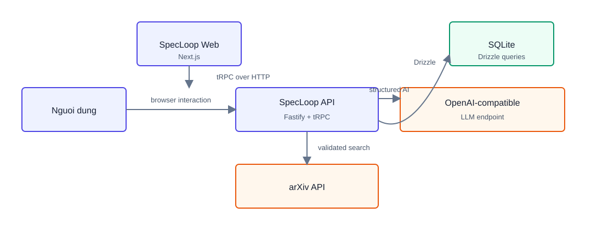
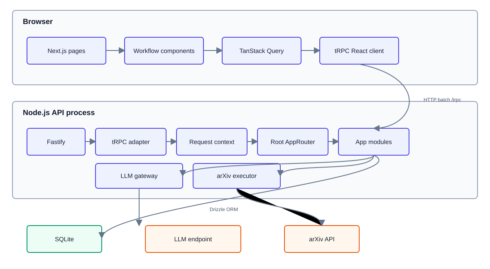
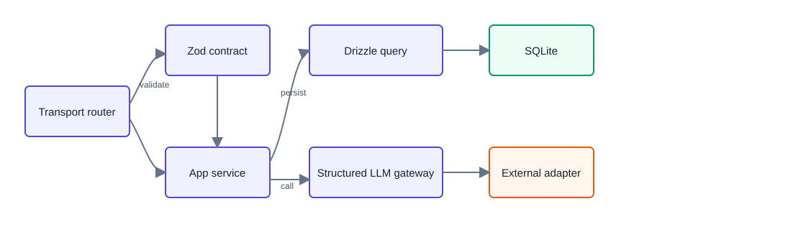
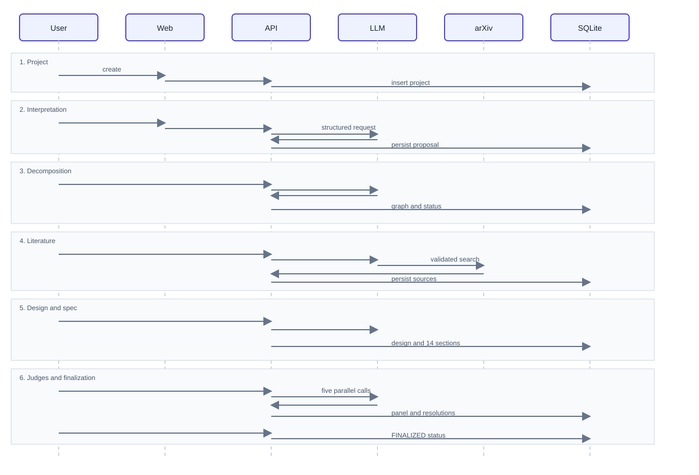
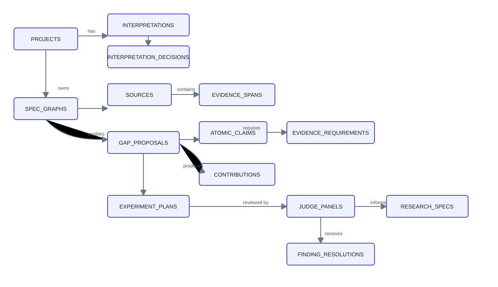
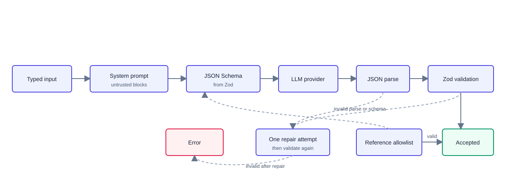

# SpecLoop - Tài liệu kiến trúc hệ thống

| Thuộc tính            | Giá trị                                                               |
| --------------------- | --------------------------------------------------------------------- |
| Tên hệ thống          | SpecLoop                                                              |
| Loại tài liệu         | System Architecture Document                                          |
| Trạng thái            | As-built                                                              |
| Ngày đối chiếu source | 2026-09-03                                                            |
| Phạm vi khảo sát      | apps/web, apps/api, packages/schemas, cấu hình workspace và container |
| Cơ sở nội dung        | Source code và cấu hình đang tồn tại trong repository                 |

## 1. Mục đích và phạm vi

Tài liệu mô tả kiến trúc đang được triển khai trong repository SpecLoop. Nội
dung tập trung vào:

- cấu trúc runtime của web, API và database;
- ranh giới giữa các module nghiệp vụ;
- giao tiếp giữa frontend và backend;
- mô hình dữ liệu được triển khai bằng Drizzle và SQLite;
- luồng xử lý LLM và arXiv;
- workflow từ tạo project đến finalization;
- các cơ chế validation, trạng thái, lỗi và bảo mật;
- cấu hình chạy local và Docker hiện có;
- các giới hạn có thể xác nhận trực tiếp từ source.

Tài liệu không mô tả kiến trúc tương lai và không coi comment hoặc tên class là
bằng chứng nếu hành vi code thực tế khác với tên đó.

## 2. Tổng quan kiến trúc

SpecLoop là monorepo TypeScript sử dụng pnpm workspace. Hệ thống hiện có ba
khối code chính:

1. Web application trong apps/web.
2. API application trong apps/api.
3. Shared runtime contracts trong packages/schemas.

Luồng giao tiếp chính:

```text
Trình duyệt
  -> Next.js web application
  -> tRPC React client
  -> HTTP /trpc
  -> Fastify API
  -> tRPC router
  -> application module
  -> Drizzle ORM
  -> SQLite
```

Các thao tác cần AI hoặc dữ liệu học thuật đi tiếp từ API tới:

```text
Fastify API
  -> OpenAI-compatible LLM endpoint
  -> arXiv API
```

Toàn bộ nghiệp vụ backend chạy trong một API process. Repository không có
worker process, message queue hoặc job scheduler.

## 3. Đặc trưng kiến trúc

| Đặc trưng                     | Cách thể hiện trong code                                                   |
| ----------------------------- | -------------------------------------------------------------------------- |
| Monorepo                      | pnpm-workspace.yaml quản lý apps/* và packages/*                           |
| Một ngôn ngữ chính            | Web, API và schema đều dùng TypeScript                                     |
| Modular backend               | Router và service được chia theo capability                                |
| Typed API                     | Web import AppRouter từ package API                                        |
| Runtime validation            | Input, output và model response dùng Zod                                   |
| Relational persistence        | Drizzle ORM với SQLite và foreign key                                      |
| AI có giới hạn quyền          | Model trả structured proposal; application gán ID và ghi dữ liệu           |
| Human-in-the-loop             | User xác nhận interpretation, node, source và finding resolution           |
| Deterministic post-processing | Status rules, consensus, spec assembly và diff chạy trong application code |
| Local demo support            | Web có fixture mode; SQLite có chế độ in-memory                            |

## 4. System context



Source: [system-context.mmd](assets/architecture/current/system-context.mmd)

### 4.1. Actors và external systems

| Thành phần       | Vai trò                                                                                     |
| ---------------- | ------------------------------------------------------------------------------------------- |
| Người dùng       | Tạo project, xác nhận nội dung, chọn nguồn, sửa graph, review Judge và finalize             |
| LLM provider     | Sinh interpretation, decomposition, query, analysis, gap, claim, experiment và Judge report |
| arXiv            | Cung cấp metadata và abstract của paper                                                     |
| Local filesystem | Lưu file SQLite khi DATABASE_PATH hoặc DB_FILE_NAME được cấu hình                           |

### 4.2. Trust boundaries

- Dữ liệu từ browser được kiểm tra lại tại tRPC procedure.
- Dữ liệu từ LLM phải parse và qua Zod validation trước khi sử dụng.
- Nội dung user, paper và evidence được đóng gói như untrusted content khi gửi
  tới model.
- Model không trực tiếp ghi database.
- Model không trực tiếp thực thi arXiv request; application nhận tool call,
  kiểm tra tham số rồi mới chạy executor.
- SQLite là data store duy nhất của API hiện tại.

## 5. Container view



Source: [container-view.mmd](assets/architecture/current/container-view.mmd)

### 5.1. Web container

- Framework: Next.js 16 với App Router.
- UI runtime: React 19.
- Server-state client: TanStack Query.
- API client: tRPC React với httpBatchLink và superjson.
- Styling: Tailwind CSS 4, shadcn-related components, Base UI và Lucide.
- Markdown: react-markdown, remark-gfm và build-md.
- Download: file-saver.

### 5.2. API container

- Runtime: Node.js ESM.
- HTTP server: Fastify 5.
- API protocol: tRPC 11.
- Validation: Zod 4.
- Persistence: Drizzle ORM với node:sqlite.
- LLM SDK: OpenAI SDK với base URL tùy chọn.
- Academic integration: @everdeep/arxiv.
- Environment validation: @t3-oss/env-core.
- Logging: Fastify logger.

### 5.3. Shared schema package

packages/schemas là package contract dùng chung. Package cung cấp:

- Zod schemas cho input và output;
- TypeScript types suy ra từ schema;
- enum trạng thái và authority;
- contract cho graph, literature, evidence, research design, Judge, revision và
  research spec;
- fixture dùng trong test.

## 6. Cấu trúc source code

```text
spec-research-loop/
├── apps/
│   ├── web/
│   │   └── src/
│   │       ├── app/
│   │       ├── components/ui/
│   │       ├── components/workflow/
│   │       └── lib/
│   └── api/
│       ├── drizzle/
│       └── src/
│           ├── db/
│           ├── integration/
│           ├── llm/
│           ├── modules/
│           ├── routers/
│           ├── store/
│           ├── trpc/
│           ├── index.ts
│           └── server.ts
├── packages/
│   └── schemas/
│       └── src/
├── docker-compose.yml
├── package.json
└── pnpm-workspace.yaml
```

### 6.1. Dependency direction

```text
apps/web
  -> @specloop/api (AppRouter type)
  -> @specloop/schemas

apps/api
  -> @specloop/schemas
  -> application modules
  -> Drizzle / OpenAI / arXiv

packages/schemas
  -> Zod
```

packages/schemas không phụ thuộc web hoặc API. API không import UI component.
Frontend nhận contract API thông qua AppRouter thay vì duy trì một bản type
riêng.

## 7. Kiến trúc frontend

### 7.1. Route map

| Route                               | Component responsibility              |
| ----------------------------------- | ------------------------------------- |
| /                                   | Trang vào hệ thống                    |
| /projects                           | Danh sách project                     |
| /projects/new                       | Tạo project                           |
| /projects/[projectId]/understanding | Interpretation và user confirmation   |
| /projects/[projectId]/decomposition | Graph node, relation và status        |
| /projects/[projectId]/research      | Literature, gap, claim và experiment  |
| /projects/[projectId]/final-review  | Spec, Judge, revision, diff và export |
| /history                            | Giao diện lịch sử                     |
| /help                               | Giao diện trợ giúp                    |

Root layout gắn TRPCProvider cho toàn bộ application.

### 7.2. Client data flow

apps/web/src/lib/trpc.ts tạo typed client từ AppRouter. URL API được lấy từ
NEXT_PUBLIC_API_BASE_URL và mặc định là http://localhost:4000.

TRPCProvider khởi tạo:

- một QueryClient;
- staleTime mặc định 30 giây;
- refetchOnWindowFocus bằng false;
- một tRPC client dùng httpBatchLink;
- superjson làm transformer.

Các workflow component dùng useQuery và useMutation trực tiếp từ typed client.
Sau mutation, component invalidate hoặc refetch query liên quan.

### 7.3. Workflow UI composition

Frontend chia workflow thành bốn workspace chính:

| Workspace | Chức năng                                                       |
| --------- | --------------------------------------------------------------- |
| step1     | Tạo project, generate/revise/regenerate/confirm interpretation  |
| step2     | Generate và chỉnh sửa decomposition graph                       |
| step3-6   | Tìm paper, chọn corpus, sinh gap, claim và experiment           |
| step7-10  | Sinh spec, chạy Judge, lưu resolution, diff, finalize và export |

AppShell đọc các query hiện tại để tính trạng thái workflow và điều hướng giữa
các bước.

### 7.4. Fixture mode

Các route workflow nhận query parameter fixture=1. Trong fixture mode:

- API queries bị disable ở các workspace tương ứng;
- dữ liệu local fixture được dùng để render UI;
- một số thao tác chỉ thay đổi React state;
- trạng thái fixture không phải dữ liệu được persist bởi backend.

### 7.5. Markdown export

Markdown export chạy ở browser:

1. FinalReviewWorkspace lấy ResearchSpec và Judge data.
2. markdown-export.ts dùng build-md để tạo nội dung.
3. Blob được tạo trong browser.
4. file-saver tải file xuống máy người dùng.

API hiện không có export router hoặc export table.

## 8. Kiến trúc API

### 8.1. Server bootstrap

apps/api/src/server.ts thực hiện:

1. Khởi tạo persistence và chạy migration.
2. Tạo Fastify instance.
3. Cấu hình log level từ environment.
4. Đặt maxParamLength bằng 1000 cho tRPC batch path.
5. Đăng ký CORS với WEB_ORIGIN và credentials=true.
6. Mount tRPC adapter tại /trpc.
7. Đăng ký GET /healthz.
8. Listen tại API_HOST và API_PORT.
9. Đóng Fastify và SQLite khi nhận SIGTERM hoặc SIGINT.

### 8.2. Request context

Mỗi tRPC request nhận ApiContext gồm:

| Field          | Nội dung                                       |
| -------------- | ---------------------------------------------- |
| requestId      | UUID sinh cho request                          |
| user           | Demo user cố định khi caller không truyền user |
| llm            | Shared OpenAI-compatible client                |
| llmConfig      | Model, timeout, retry và provider config       |
| interpretation | Interpretation module instance                 |
| specStructure  | Decomposition module instance                  |

protectedProcedure chỉ kiểm tra ctx.user có tồn tại. Vì default context luôn
gắn demo user, đây là cơ chế demo và không phải xác thực danh tính thực.

### 8.3. Router composition

Root AppRouter gồm:

```text
health
projects
decomposition
literature
evidence
researchDesign
interpretation
judge
specGeneration
revision
```

AppRouter được export từ @specloop/api để frontend suy ra type end-to-end.

### 8.4. API surface

| Router         | Procedures                                                                                           |
| -------------- | ---------------------------------------------------------------------------------------------------- |
| health         | health                                                                                               |
| projects       | list, create, byId                                                                                   |
| interpretation | generate, regenerate, latest, decisions, revise, confirm                                             |
| decomposition  | generate, byProject, updateNode, createRelation, deleteRelation, changeStatus                        |
| literature     | generateQueries, searchWithAnalysis, search, importManual, list, select, selectedCount               |
| evidence       | createSpan, listSpans, generateEvidenceForClaim, listEvidenceRequirements, getEvidenceRequirement    |
| researchDesign | generateGapProposal, generateClaimDesign, generateExperimentPlan, listClaims, listPlans, gapProposal |
| specGeneration | generate, getLatest, listVersions                                                                    |
| judge          | runPanel, getLatestPanel                                                                             |
| revision       | recordFindingResolution, listFindingResolutions, rerunJudge, diffVersions, finalize                  |

projects.create, các interpretation procedure và các decomposition procedure
dùng protectedProcedure. Nhiều procedure còn lại dùng publicProcedure.

### 8.5. Error model

tRPC error formatter bổ sung Zod validation detail vào data.zodError khi cause
là ZodError.

Router chuyển lỗi thành các TRPCError code đang dùng trong code:

- BAD_REQUEST;
- UNAUTHORIZED;
- NOT_FOUND;
- CONFLICT;
- PRECONDITION_FAILED;
- INTERNAL_SERVER_ERROR.

Fastify onError ghi path và error vào application log.

## 9. Backend component model



Source: [backend-component-model.mmd](assets/architecture/current/backend-component-model.mmd)

### 9.1. Capability modules

| Module          | Trách nhiệm thực tế                                                                             |
| --------------- | ----------------------------------------------------------------------------------------------- |
| interpretation  | Sinh interpretation, lưu version, revise, regenerate, confirm và decision history               |
| decomposition   | Đọc confirmed interpretation, sinh graph, sửa node/relation và quản lý status                   |
| literature      | Sinh search query, tìm arXiv, lọc relevance, phân tích paper, manual import và corpus selection |
| evidence        | Tạo/list evidence span và sinh/list evidence requirement                                        |
| research-design | Sinh gap proposal, contribution, atomic claim và experiment plan                                |
| spec-generation | Tạo 14 section từ dữ liệu đã persist và quản lý spec version                                    |
| judge           | Chạy năm Judge độc lập và tính consensus                                                        |
| revision        | Lưu resolution, rerun một Judge, diff version và finalize                                       |
| llm             | Quản lý client, structured output, tool registry và arXiv executor                              |

### 9.2. Interpretation module

Interpretation generation:

```text
Project data
  -> input schema validation
  -> prompt construction
  -> structuredCall
  -> InterpretationOutputSchema
  -> application gán ID, provider, model và timestamp
  -> status PROPOSED
  -> repository persist
```

Repository quản lý ba thao tác thay đổi lifecycle:

- regenerate tạo proposal mới và supersede active record;
- revise tạo proposal mới từ EDIT hoặc OTHER;
- confirm chuyển proposal được chọn sang USER_CONFIRMED.

Decision được lưu riêng trong interpretation_decisions.

### 9.3. Decomposition module

Decomposition có boundary rõ qua ports:

- ConfirmedInterpretationReader;
- DecompositionGenerator;
- SpecGraphRepository;
- SpecGraphStore.

DecompositionService chỉ generate khi đọc được confirmed interpretation.
LlmDecompositionGenerator yêu cầu đủ các node type bắt buộc. Store thực hiện:

- save graph;
- get graph theo project;
- update node;
- create/delete relation;
- change status;
- tính deterministic warnings.

Class InMemorySpecGraphStore có tên lịch sử, nhưng implementation hiện tại đọc
và ghi qua Drizzle/SQLite.

### 9.4. Literature module

Literature hỗ trợ hai đường search:

1. User cung cấp query, application gọi arXiv trực tiếp.
2. LLM chọn query bằng search_arxiv tool, application thực thi tool, sau đó LLM
   lọc relevance và phân tích paper.

Search workflow có giới hạn ba attempt. Metadata paper đến từ arXiv; các trường
analysis do LLM sinh. Application kiểm tra external ID của analysis thuộc tập
paper thực sự trả về trước khi persist.

Manual import tạo source có provenance riêng. Source selection do user mutation
thực hiện.

### 9.5. Evidence module

EvidenceSpan hỗ trợ ba entry type:

```text
EXACT
ABSTRACT
MANUAL
```

EXACT có page và character offsets; ABSTRACT/MANUAL là fallback provenance.
EvidenceRequirement liên kết claim với metric, operator, threshold, success
criterion và falsification criterion.

Không có HTTP upload handler, PDF parser hoặc document page table trong source
hiện tại.

### 9.6. Research design module

Module này thực hiện ba AI task nối tiếp:

```text
Selected corpus + research question
  -> gap proposal
  -> selected gap candidate
  -> contribution + atomic claims
  -> evidence requirements
  -> experiment plan
```

LLM output được validate rồi application gán ID và persist. Experiment plan có
claim links, baselines, metrics, controls, ablations, generalization proposal và
resource estimates.

### 9.7. Spec generation module

Spec generation không gọi LLM. Service đọc dữ liệu hiện tại và assemble đúng
14 section theo SPEC_SECTION_ORDER:

```text
PROBLEM_STATEMENT
RESEARCH_QUESTIONS
RELATED_WORK_MATRIX
RESEARCH_GAP
PROPOSED_APPROACH
EXPECTED_CONTRIBUTIONS
CLAIM_EVIDENCE_MATRIX
EXPERIMENTAL_PROTOCOL
BASELINES_AND_METRICS
ABLATION_PLAN
COMPUTE_BUDGET
RISKS_AND_LIMITATIONS
OPEN_ISSUES
DECISION_HISTORY
```

Mỗi lần generate tạo ResearchSpec DRAFT mới với version tăng dần. Section thiếu
dữ liệu được đánh dấu isPlaceholder thay vì tạo nội dung giả.

### 9.8. Judge module

Hệ thống hiện có năm Judge:

```text
GAP
CONTRIBUTION
EXPERIMENT
EVIDENCE
CONFERENCE_READINESS
```

Mỗi Judge có prompt và context builder riêng. runJudgePanel chạy năm call bằng
Promise.all; mỗi call không nhận finding của Judge khác.

Sau khi đủ report, computeConsensus tính:

- số finding theo CRITICAL, MAJOR và MINOR;
- overallSeverity;
- section được ít nhất hai Judge cùng đánh dấu;
- readyToFinalize.

Consensus là phép tính application-side, không phải output từ model.

### 9.9. Revision module

Revision hỗ trợ:

- ghi RESOLVED, DISMISSED hoặc DEFERRED cho finding;
- rerun đúng một Judge;
- merge report mới vào panel;
- tính lại consensus;
- diff section giữa hai spec version;
- finalize một version.

finalizeResearchSpec yêu cầu đã có Judge panel và chặn khi latest panel còn
CRITICAL finding. Code finalization không chặn MAJOR, dù Consensus.readyToFinalize
chỉ true khi không còn CRITICAL và MAJOR.

## 10. Luồng nghiệp vụ end-to-end



Source: [workflow-sequence.mmd](assets/architecture/current/workflow-sequence.mmd)

Các LLM call và arXiv call chạy ngay trong tRPC request. API không trả job ID và
không có background execution.

## 11. Data architecture

### 11.1. Database runtime

apps/api/src/db/client.ts dùng:

- DatabaseSync từ node:sqlite;
- drizzle-orm/node-sqlite;
- Drizzle migrator;
- một singleton database connection trong process.

Database path được resolve theo thứ tự:

```text
DATABASE_PATH
  -> DB_FILE_NAME
  -> DATABASE_URL nếu là file path
  -> :memory:
```

Khi dùng file database, code tạo parent directory. Khi được SQLite hỗ trợ, code
bật WAL và foreign_keys.

### 11.2. Physical tables

| Table                    | Mục đích                                                    |
| ------------------------ | ----------------------------------------------------------- |
| projects                 | Root project, raw idea và resource constraints              |
| interpretations          | Các version interpretation và status                        |
| interpretation_decisions | Confirm, edit, regenerate và other decision                 |
| spec_graphs              | Graph node, relation, warning và status history của project |
| sources                  | Paper/source metadata và analysis                           |
| evidence_spans           | Evidence text cùng provenance                               |
| gap_proposals            | Các gap candidate đã sinh                                   |
| atomic_claims            | Claim đã chuẩn hóa                                          |
| contributions            | Contribution liên kết gap và claim                          |
| evidence_requirements    | Metric/threshold cần để kiểm chứng claim                    |
| experiment_plans         | Baseline, metric, protocol, ablation và estimate            |
| judge_panels             | Năm Judge report và consensus                               |
| research_specs           | Research spec version                                       |
| finding_resolutions      | Quyết định của user cho finding                             |

Không có table cho user account, session, file upload, document page, job run,
model call log hoặc export artifact.

### 11.3. Storage pattern

projects lưu các field chính trực tiếp trong column. Các entity còn lại thường
dùng hai lớp:

1. Relational column cho ID, project ID, parent foreign key và timestamp.
2. data column chứa JSON của full entity.

JSON được parse và validate lại bằng Zod khi đọc. Foreign key bảo vệ quan hệ
giữa các bước và phần lớn dùng ON DELETE CASCADE.

### 11.4. Entity relationship diagram



Source: [data-model.mmd](assets/architecture/current/data-model.mmd)

### 11.5. Core data invariants

- Project ID dùng UUID.
- spec_graphs có một row cho mỗi project.
- Interpretation phải USER_CONFIRMED trước khi decomposition.
- Relation phải tham chiếu node trong cùng graph.
- AI không được gán USER_CONFIRMED hoặc SYSTEM_VERIFIED.
- Source selection là boolean do application cập nhật.
- Evidence requirement phải tham chiếu atomic claim.
- Research spec phải có đúng 14 section theo đúng thứ tự.
- Research spec status chỉ là DRAFT hoặc FINALIZED.
- Finding resolution phải tham chiếu finding của latest panel.
- Diff yêu cầu toVersion lớn hơn hoặc bằng fromVersion.

## 12. AI architecture

### 12.1. Provider configuration

LLM client dùng OpenAI SDK. Cấu hình gồm:

```text
OPENAI_API_KEY
OPENAI_BASE_URL
OPENAI_ORGANIZATION
LLM_MODEL
LLM_TIMEOUT_MS
LLM_MAX_RETRIES
```

Client và config được cache trong API process.

### 12.2. Structured output pipeline



Source: [ai-pipeline.mmd](assets/architecture/current/ai-pipeline.mmd)

structuredCall thực hiện tối đa một repair attempt cho JSON lỗi, schema mismatch
hoặc ID ngoài allowlist. Application không tự đoán field hoặc ID bị thiếu.

Một số paper-analysis call dùng forced function call thay vì response_format,
sau đó vẫn parse JSON, validate schema và kiểm tra external ID.

### 12.3. Authority model

| Actor  | Quyền trong dữ liệu                                                        |
| ------ | -------------------------------------------------------------------------- |
| AI     | Sinh PROPOSED, NEEDS_REVIEW, MISSING, AMBIGUOUS, UNSUPPORTED hoặc CONFLICT |
| USER   | Confirm, reject, revise, chọn source và quyết định finding                 |
| SYSTEM | Chạy rule deterministic, cập nhật warning/status history và tính consensus |

ID, timestamp, provider, model, Judge identity và persisted status được
application gán sau validation.

## 13. Security architecture

### 13.1. Implemented controls

- API key và provider config lấy từ environment.
- Environment được validate tập trung.
- Zod kiểm tra tRPC input/output.
- LLM output được parse và validate.
- Untrusted content được đánh dấu và tách khỏi system prompt.
- Referenced ID có thể bị giới hạn bằng allowlist.
- arXiv tool arguments được validate trước khi executor chạy.
- CORS chỉ nhận WEB_ORIGIN được cấu hình.
- SQLite foreign key được bật.
- Error được chuyển thành TRPCError thay vì trả object tùy ý.
- Process có graceful shutdown cho HTTP server và database.

### 13.2. Current security limitations

- Không có đăng nhập, session, token hoặc identity provider.
- Demo user được gắn mặc định vào mọi request.
- Nhiều workflow procedure là publicProcedure.
- Không có project ownership column hoặc authorization check theo user.
- Không có upload boundary nên chưa có MIME/size/malware validation.
- Không có persistent audit log.
- Không có rate limiter hoặc budget enforcement middleware.
- Fastify error logging nhận nguyên error object; cần kiểm tra redaction trước
  khi dùng với dữ liệu nhạy cảm.

## 14. Reliability and consistency

### 14.1. Implemented mechanisms

- Input/output validation ở API boundary.
- Structured LLM output với một repair attempt.
- SDK-level timeout và maxRetries từ environment.
- arXiv search loop giới hạn attempt.
- Explicit precondition errors giữa các bước.
- Foreign key và cascade deletion.
- Append-only spec versions.
- Independent Judge execution.
- Deterministic consensus và section diff.
- Graceful shutdown.

### 14.2. Current limitations

- LLM và arXiv chạy trong request path.
- Không có queue, retry worker, persisted progress hoặc cancellation.
- Một số service thực hiện nhiều insert/update mà không bọc trong một transaction
  dùng chung.
- Version number được tính từ số record hiện có, nên concurrent generation có
  thể tạo cạnh tranh.
- Database mặc định :memory: nếu không cấu hình path, vì vậy mất dữ liệu khi
  process dừng.
- Finalization policy và Consensus.readyToFinalize không hoàn toàn giống nhau
  đối với MAJOR finding.
- Không có idempotency key cho generate, runPanel hoặc finalize.

## 15. Observability

Hệ thống hiện có:

- Fastify structured logger;
- configurable LOG_LEVEL;
- requestId trong tRPC context;
- log tại tRPC onError;
- timestamp trong health response;
- provider, model, prompt version và retryCount trên một số persisted entity.

Hệ thống hiện không có:

- middleware gắn requestId vào mọi log;
- metrics endpoint;
- distributed tracing;
- persisted model-call log;
- persisted job log;
- token/cost dashboard;
- alerting.

## 16. Deployment architecture

### 16.1. Local development

Workspace scripts:

```text
pnpm dev
pnpm dev:web
pnpm dev:api
pnpm typecheck
pnpm test
pnpm lint
pnpm build
```

Port mặc định:

| Process | Port                          |
| ------- | ----------------------------- |
| Web     | 3000                          |
| API     | 4000                          |
| Health  | http://localhost:4000/healthz |
| tRPC    | http://localhost:4000/trpc    |

API dev script đọc .env trong working directory của apps/api. Next.js đọc
environment của apps/web.

### 16.2. Docker Compose topology

docker-compose.yml khai báo hai service:

```text
web
  -> depends_on api

api
  -> sqlite_data volume
  -> ./storage host mount
```

API container dùng Node 22 và chạy apps/api/dist/server.js. DATABASE_PATH được
đặt thành /app/data/specloop.db.

### 16.3. Container definition limitations

Cấu hình runtime/container hiện có ba bất nhất quan sát được từ source:

1. Compose đặt build context là apps/web, nhưng Dockerfile copy các path ở
   workspace root như pnpm-workspace.yaml, packages và apps.
2. Runtime stage của web dùng node:20-alpine và gọi pnpm, nhưng stage đó không
   bật Corepack hoặc copy PNPM_HOME từ build stage.
3. Root package cho phép Node từ 20.11, trong khi API import node:sqlite và API
   Dockerfile yêu cầu Node 22.

Vì vậy Docker definition tồn tại nhưng web image và local API runtime không nên
được coi là tương thích cho tới khi các điểm trên được sửa và command thực tế
được chạy thành công.

## 17. Test architecture

Vitest được cấu hình trong cả ba workspace:

| Workspace        | Test focus quan sát được                                                                                |
| ---------------- | ------------------------------------------------------------------------------------------------------- |
| packages/schemas | Schema, fixture, decomposition và discovery contract                                                    |
| apps/api         | Structured call, interpretation, decomposition, Judge, spec generation, revision và tRPC context/router |
| apps/web         | Workflow progress, Step 2 model và Markdown export                                                      |

apps/api/src/integration/step1-step2.test.ts kiểm tra handoff giữa confirmed
interpretation và decomposition.

Các external call được thiết kế với injection point hoặc fake client trong test.
Sự tồn tại của test file không đồng nghĩa test đang pass; trạng thái phải được
xác nhận bằng command thực tế.

## 18. Current system limitations

Các capability sau không tồn tại trong source hiện tại:

| Capability                 | Bằng chứng kiến trúc hiện tại                                       |
| -------------------------- | ------------------------------------------------------------------- |
| Background worker          | Không có apps/worker hoặc worker entrypoint                         |
| Message queue              | Không có Redis/BullMQ dependency hoặc queue adapter                 |
| PDF ingestion              | Không có upload route, multipart handler hoặc PDF parser dependency |
| File metadata              | Không có source_files hoặc document_pages table                     |
| Real authentication        | Chỉ có demo user trong ApiContext                                   |
| User authorization         | Không có user ownership relation trên project                       |
| Job tracking               | Không có job_runs table hoặc jobs router                            |
| Model-call audit           | Không có model_calls table                                          |
| Server-side export         | Export chạy trong browser                                           |
| Multi-instance persistence | SQLite file dùng local filesystem                                   |
| Real-time progress         | Không có SSE, WebSocket hoặc polling job state                      |

## 19. Kết luận kiến trúc

Kiến trúc đang tồn tại có thể tóm tắt như sau:

```text
pnpm TypeScript monorepo
  + Next.js workflow frontend
  + TanStack Query and typed tRPC client
  + Fastify tRPC modular backend
  + shared Zod contracts
  + Drizzle SQLite persistence
  + OpenAI-compatible structured-output gateway
  + application-controlled arXiv tool
  + deterministic spec, consensus and revision logic
  + browser-side Markdown export
  + local fixture mode
```

Đây là kiến trúc của source hiện tại. Repository chưa có worker, queue, PDF
pipeline, real authentication, server-side export hoặc operational audit
subsystem.
