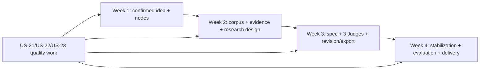

# SpecLoop — Four-Week Delivery Plan

**Trạng thái:** `PLANNED`  
**Team:** 3 roles, không gán tên cá nhân  
**Planning unit:** vertical slice; P0 feature estimate khoảng 45 PD, chưa gồm toàn bộ contingency

## 1. Delivery principles

- Tích hợp theo vertical slice mỗi tuần; không chia ba silo Frontend/Backend/AI.
- P0 end-to-end phải chạy trước khi kết thúc tuần 3.
- Cuối tuần 3 feature freeze P0; tuần 4 không bắt đầu P2.
- Manual source/evidence fallback, in-process job mode, basic diff và Markdown-only export là cut-line hợp lệ.
- Mỗi story chỉ chuyển khỏi `PLANNED` khi acceptance criteria và planned test evidence thực sự tồn tại.
- Không dùng số liệu latency/cost/result giả để đáp ứng exit criteria.

## 2. Role allocation

| Role | Primary areas | Cross-role obligation |
| --- | --- | --- |
| Member 1 — Product Workflow and Frontend Lead | Journey, UI, confirmation, spec/revision/version screens, E2E UX | Review API contracts; test own slice; support report/demo |
| Member 2 — Backend, Data and Platform Lead | FastAPI, PostgreSQL, migrations, APIs, job state, files, Docker, reliability | Support UI integration and AI persistence; integration/security tests |
| Member 3 — AI, Evidence and Evaluation Lead | Schemas/prompts, literature/evidence, generator, Judges, baselines/evaluation | Support backend contracts and user-facing explanations; contract tests |

Mỗi Epic có primary role trong backlog và ít nhất một supporting role khi cần. Daily integration/checkpoint là planning practice; tài liệu không khẳng định đã diễn ra.

## 3. Week 1 — Foundation, interpretation and basic decomposition

### Sprint goal

User tạo project, nhập idea, nhận interpretation, xác nhận và thấy structured nodes/relations được lưu; nền job/log/test tối thiểu đã sẵn sàng cho các tuần sau.

### User stories

- US-01 — Project CRUD và idea/constraints.
- US-02 — Simple/technical interpretation.
- US-03 — Confirm/Edit/Regenerate/Other và confirmation gate.
- US-04 — Typed nodes.
- US-05 — Relations/status history.
- US-06 — Basic missing/ambiguity/conflict/unsupported rules.
- US-21 — Job/log foundation phần cần cho interpretation.
- US-22 — Security/retry/budget foundation tương ứng slice tuần 1.
- US-23 — Test/setup foundation tương ứng slice tuần 1.

### Planned deliverables

- Planned monorepo/app skeleton và environment contract sau khi implementation được bắt đầu.
- Project and Understanding screens.
- Project, workflow, nodes/relations persistence model.
- Interpretation/decomposition schemas and prompt versions.
- First vertical integration: idea → confirmed interpretation → persisted nodes.
- Unit/contract/integration tests cho gate, schema và core state.

### Dependencies

- Chốt demo user hay minimal auth ở mức đủ cho data ownership.
- Chọn LLM provider/model và configuration boundary.
- Define initial job lifecycle và error envelope.

### Exit criteria

1. US-01…US-06 planned acceptance được chứng minh bằng test/result thật.
2. User không thể decomposition trước `USER_CONFIRMED`.
3. AI cannot assign `USER_CONFIRMED/SYSTEM_VERIFIED` directly.
4. Project/nodes survive API round-trip and persistence.
5. At least one integration path has actual observed output; otherwise status remains `PLANNED`.

### Risks

- Mất thời gian vào authentication hoặc UI polish.
- Schema churn giữa frontend/backend/AI.
- Provider structured output không ổn định.

### Cut line

- Không làm complex auth/authorization.
- Card/table UI đủ; không graph/React Flow/animation.
- Một interpretation workflow và rule set tối thiểu; không domain-specific expansion.

### P1/P2 loại nếu trễ

Golden prompt regression, graph visualization, collaboration, advanced UI animation và mọi P2.

## 4. Week 2 — Literature, evidence, gap, claim and experiment

### Sprint goal

User xây selected corpus, lưu evidence có provenance, kiểm tra claim–evidence và tạo research design/feasibility plan.

### User stories

- US-07 — One academic API + manual import.
- US-08 — Provenance-aware related-work matrix.
- US-09 — Safe PDF parsing/manual evidence.
- US-10 — Evidence span/link.
- US-11 — Claim–evidence integrity.
- US-12 — Gap candidates.
- US-13 — Contributions/atomic claims.
- US-14 — Experiment plan/estimate.
- US-21/US-22/US-23 — Jobs, limits, injection/upload controls and tests for this slice.

### Planned deliverables

- Literature Workbench với một API, normalize/deduplicate/select và manual import.
- Private local PDF storage, PyMuPDF page extraction và manual fallback.
- Evidence span/link model, deterministic integrity và atomic review contract.
- Related-work matrix with provenance.
- Research Design workspace cho gap, contribution, claims, experiment và estimates.
- Integration flow từ selected source đến claim–experiment matrix.

### Dependencies

- Academic API selection/rate/auth behavior.
- Manual source minimum fields.
- PDF size/page/MIME limits.
- Model/token/Judge budget policy draft.

### Exit criteria

1. Một source search/import path hoạt động; manual fallback được test.
2. Valid PDF hoặc manual evidence được linked với provenance; invalid file/link bị reject.
3. Gap always shows corpus-bounded novelty warning.
4. Claim schema có scope/falsification và evidence/experiment disposition.
5. Experiment plan gồm B0, B1, Proposed, metrics, control và ablation; estimate labels assumptions.

### Risks

- API rate limit/outage hoặc metadata không đồng nhất.
- PDF extraction/offset sai.
- Atomic verifier trả structured output không ổn định.
- Scope phình vì source ranking, graph hoặc advanced retrieval.

### Cut line

- Nếu API thứ hai chưa ổn: giữ đúng một API + manual import.
- Nếu PDF parse lỗi: manual evidence/abstract path vẫn phải hoàn tất.
- Atomic review chỉ chạy trên phạm vi demo được nhóm chốt; deterministic integrity vẫn bắt buộc.
- Không GROBID, MinIO, citation graph, credibility scoring hoặc semantic retrieval P2.

### P1/P2 loại nếu trễ

Second API, exact-text hash, DOI verification, Claim-Scope Calibrator riêng, Redis/RQ, GROBID, MinIO/S3, citation graph, Active Candidate Selection.

## 5. Week 3 — Specification generation, three Judges and revision

### Sprint goal

Hoàn thành P0 end-to-end: user sinh specification 14 phần, nhận finding từ đúng ba Judge độc lập, quyết định revision, tạo version/diff và export Markdown.

### User stories

- US-15 — 14-section specification generation.
- US-16 — Three independent Judges.
- US-17 — Finding aggregation.
- US-18 — User revision decision.
- US-19 — Version/basic diff.
- US-20 — Finalize/Markdown export.
- US-21/US-22/US-23 — End-to-end jobs, budgets, security and tests.

### Planned deliverables

- Spec Preview đủ 14 section và provenance/status indicators.
- Evidence, Research và Experiment Judge prompts/jobs/findings.
- Deterministic consensus/single-flag/disagreement grouping.
- Judge Center, explained revision options + `Other`.
- Immutable version snapshot, basic section/node diff và Markdown export.
- End-to-end demo path idea → revision/export trước cuối tuần.

### Dependencies

- Stable node/evidence/experiment schemas từ tuần 2.
- Finalization policy cho unresolved statuses.
- Version snapshot/diff granularity.
- Budget/call limits cho three-Judge run.

### Exit criteria

1. P0 E2E reaches revised exported specification before week ends.
2. Exactly three Judges run independently; no fourth/fifth Judge in MVP.
3. Finding fixtures satisfy CRITICAL/MAJOR/MINOR policy.
4. User decision creates new version without overwriting prior snapshot.
5. Markdown export matches selected version.
6. P0 feature freeze is declared only after actual verification; otherwise blockers remain explicit.

### Risks

- Judge/prompt integration consumes budget or fails schema.
- Spec generation introduces ungrounded claims.
- Version/revision touches many modules late.
- Team postpones integration until week 4.

### Cut line

- Basic deterministic aggregation; no semantic clustering.
- Same provider/model with independent prompts/context is acceptable.
- Basic diff only; Markdown export only.
- Targeted rerun at minimal viable granularity.

### P1/P2 loại nếu trễ

Five Judges, multi-model ensemble, semantic clustering, better semantic diff, PDF/DOCX export, collaboration, cost dashboard và mọi P2.

## 6. Week 4 — Integration, testing, evaluation, deployment, report and demo

### Sprint goal

Ổn định P0 đã freeze, tạo verification/evaluation evidence, hoàn thiện reproducible setup, report và demo; không thêm capability mới.

### User stories

- US-23 là primary stabilization/evaluation story.
- US-01…US-21 chỉ nhận bug fixes, missing acceptance evidence và integration hardening; không mở rộng scope.

### Planned deliverables

- Unit, contract, API/integration, E2E và basic security suites cho critical path.
- Evidence-integrity and Judge aggregation fixtures.
- Dataset/use-case set, B0/B1/Proposed run artifacts nếu thực sự chạy.
- Human verification rubric, labels/disagreement record và limitations.
- Measured token/cost/latency records khi provider/runtime cho phép; estimate labeled separately.
- Verified local/Docker setup and deployment notes.
- Final report content based only on actual evidence, demo video và sample specification.

### Dependencies

- Feature freeze and stable schemas/prompts.
- Final dataset counts, metric formulas and labeling protocol.
- Available provider budget and deployment environment.

### Exit criteria

1. Core tests actually run and observed failures are resolved or documented.
2. B0/B1/Proposed comparison uses controlled conditions; no invented result.
3. Evidence and Judge evaluation includes human verification and limitations.
4. Setup commands actually exist and have recorded outcome before claiming reproducibility.
5. Report/demo/sample spec reflect real implementation state.
6. MVP Definition of Done contains no P1/P2.

### Risks

- Week 3 E2E incomplete consumes evaluation time.
- Labeling workload exceeds capacity.
- Deployment/provider issues block demo.
- Pressure to fabricate or overstate incomplete results.

### Cut line

- Reduce dataset within proposal ranges and report limitation rather than skip validation.
- Prefer critical E2E/integrity/contract tests over exhaustive UI coverage.
- Keep one deployment path and manual demo fallback.
- No new feature, no P2, no additional provider/Judge/export format.

### P1/P2 loại nếu trễ

Toàn bộ P1/P2, đặc biệt Redis/RQ, dashboard, second API, advanced diff, graph, five Judges, multi-model, PDF/DOCX và advanced observability.

## 7. Cross-week dependency map

## 8. Scope-control checkpoints

| Checkpoint | Required decision |
| --- | --- |
| End week 1 | Confirm schema contracts; reject complex auth/graph work. |
| Mid week 2 | If external API/PDF blocks progress, activate documented manual fallback. |
| End week 2 | Confirm E2E path can reach spec generation; do not add second API/P1. |
| Mid week 3 | Verify three Judges/revision integration; reduce polish before reducing required flow. |
| End week 3 | Freeze P0 only with actual E2E evidence; list blockers honestly. |
| Week 4 daily | Prefer verification/evaluation/report over any feature request. |

## 9. Planned delivery status

All stories, tests, deployments, evaluation runs, reports and demo artifacts in this plan are `PLANNED`. This document contains no claim that a sprint, command, test, benchmark, latency target or cost target has been completed.
